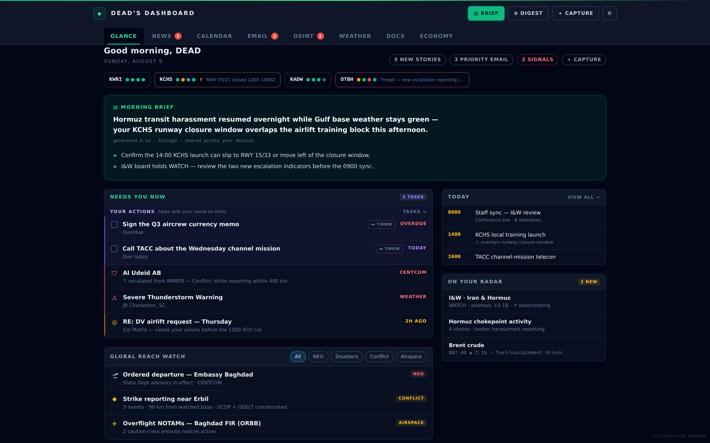

# DEAD's Dashboard

A single-user **air-mobility / crisis-planning dashboard** that fuses national-security
news, email, calendar, open-source intelligence, and a live crisis map into one
operational picture. Built with **Next.js 15 (App Router)** and deployed on
**GoDaddy Node.js Hosting** (managed Node.js PaaS + managed MySQL).



> The dashboard is organized around one question: **where will mobility forces get
> tasked next** — and what does it take to get there. News, weather, force
> protection, conflict, and airfield data all feed that read.

---

## Stack

| Layer | Choice |
|---|---|
| Frontend / SSR | Next.js 15 (App Router), React 19, Tailwind CSS |
| Server | custom `server.js` Next.js server (binds `process.env.PORT`) |
| Database | managed MySQL via `mysql2` (`lib/db.ts`) |
| AI | Anthropic SDK (`@anthropic-ai/sdk`) — Opus / Haiku per route |
| Auth | NextAuth 5 + Google OAuth, single-user (allowlisted by `OWNER_EMAIL`) |
| Maps | React-Leaflet 5 + OpenStreetMap / CARTO dark tiles, `h3-js` for GPS hexes |
| Icons | `lucide-react` (vocabulary in `lib/icons.tsx`) |
| Realtime | `ws` — server-side AISStream vessel bridge |

All outbound traffic is **HTTPS (443)** only (plus the managed MySQL), per the
hosting platform's network policy. The container is ephemeral — all state lives
in the managed database.

---

## Features

Eight tabs (`lib/icons.tsx` → `TAB_ICONS`), plus a Morning Brief (timezone-aware —
auto-follows the device zone or pins to a chosen one, and includes a live Base
SITREP block) and a floating AI assistant in the top bar:

- **Glance** — the at-a-glance landing view, including the **Global Reach Watch**
  (NEO/evacuation, disasters, base weather, and access degraders — conflict, GPS/EW,
  airspace — ranked into one list with category filters).
- **News** — national-security RSS across ~20 sources, preference-sorted, with
  bookmarking, save-to-Docs, and up/down feedback signals.
- **Calendar** — Google Calendar + Tasks, an iCal subscription feed, and a chat
  rail that can add events/tasks.
- **Email** — AI-triaged unread inbox across a primary + optional secondary Gmail
  account, with action-item extraction and VIP/mute rules.
- **Docs** — a personal markdown wiki grown into a **synthesis workbench**:
  typed wiki-links (`[[Title | supports: note]]`), aliases, unlinked-mention
  detection, hover previews, collections / doc types / properties, a local
  knowledge graph, a term lexicon, thread timelines, compose-to-deliverable
  (merge docs into one export), split-at-headings, templates, autosave +
  version history, and a file repo (MySQL blobs).
- **OSINT** — aggregated feed panes (All / Social / Telegram / News / Crisis /
  Ground / SITREP) plus the **Crisis map**: a self-rendered Leaflet board fusing
  disasters, conflict (UCDP/ACLED), weather hazards, GPS interference, NOTAMs,
  military ADS-B + AIS movement, AMC hubs / gateways, and planning-grade reach
  rings. **Ground Truth** is a per-country situation room (incidents, advisories,
  health, AI SITREP). The **𝕏 Capture import** brings X/Twitter content in via a
  bookmarklet that collects posts in your own logged-in browser (no server-side
  credentials or scraping — X has no usable feed from a datacenter host) and
  exports a JSON file the Social pane ingests into clustering / triage / trends.
- **SITREP** — a per-base **commander's situation report** for up to 4 configured
  fields (multi-base LED tile strip; Weather / Ops / Threats / Infrastructure
  cards): decoded METAR + 24-h TAF category timeline, bucketed DAIP NOTAMs with a
  **closure-window timeline** (runway-closure × forecast-IFR conflicts called
  out), per-runway crosswind advisories, ARTCC center NOTAMs, astro/illumination,
  Force Protection + disasters + impact-filtered local news, and live
  infrastructure sensing (IODA internet, FAA NAS programs, USGS gauges — power
  stays news-derived and labeled). Includes an AI **Commander's Read** (3-bullet
  BLUF), a daily status-history strip, a block in the Morning Brief, and
  **⇩ Export HTML** — a self-contained, script-free snapshot file shareable with
  people who have no dashboard access (opens offline in any browser). Every
  unreachable source renders **UNKNOWN, never implied-clear**.
- **Economy** — a mobility-economics board: energy/fuel prices, an AI *Economic
  Access Read*, and a strategic-chokepoint watch.
- **Weather** — multi-location NWS forecasts + Open-Meteo enrichment, alerts,
  NOAA space weather, and aviation METAR/TAF.

See **[FEATURES.md](FEATURES.md)** for the full per-feature inventory (data shapes,
endpoints, caching), and **[CLAUDE.md](CLAUDE.md)** for platform/deployment notes
and the rationale behind non-obvious design decisions.

---

## Getting started (local)

Requires Node.js 20+.

```bash
npm install
cp .env.example .env.local   # fill in the values below
npm run build                 # next build (via build.js)
npm start                     # custom server on $PORT (default 3000)
```

For iterative development:

```bash
npm run dev                   # next dev with hot reload
```

### Tests

```bash
npm test                      # npx vitest run — needs network (vitest is fetched on demand)
```

Pure logic (parsers, scorers, matchers) is unit-tested against committed fixtures,
since the build sandbox can't reach external data hosts. Live data sources are
verified in production via owner-only `?debug=1` / `*-diag` endpoints.

---

## Environment variables

`PORT` and the `DB_*` connection variables are provided automatically by the
hosting platform. The rest are set via the hosting UI (see `.env.example`):

**Required:** `NEXTAUTH_URL`, `NEXTAUTH_SECRET`, `GOOGLE_CLIENT_ID`,
`GOOGLE_CLIENT_SECRET`, `ANTHROPIC_API_KEY`, `OWNER_EMAIL`.

**Optional** (feature simply stays off when unset, never a hard error):
`GMAIL_SECONDARY_REDIRECT_URI` (second Gmail account), `AISSTREAM_API_KEY` (live
maritime AIS), `UCDP_API_TOKEN` (Crisis-map conflict layer), and ACLED credentials
(set in Preferences, or `ACLED_EMAIL` / `ACLED_PASSWORD` to override).

---

## Database

The managed MySQL instance is provisioned by the platform; credentials arrive as
`DB_HOST` / `DB_PORT` / `DB_NAME` / `DB_USER` / `DB_PASSWORD`. Schema is created
automatically on first connection — every table is `CREATE TABLE IF NOT EXISTS`
with an idempotent additive-column migration list in `lib/db.ts`, so **no manual
import is needed**. All queries are parameterized.

---

## Deployment

Built for GoDaddy Node.js Hosting: upload the project folder; the platform runs
`npm install` → `npm run build` → `npm start`. A few platform-specific
constraints are load-bearing and documented in **[CLAUDE.md](CLAUDE.md)**:

- The build toolchain (`typescript`, `tailwindcss`, `postcss`, …) lives in
  **`dependencies`**, not `devDependencies` — the platform installs with
  `--production`.
- **No `esbuild` in the dependency tree** (`grep -c esbuild package-lock.json`
  must stay `0`) — it breaks the platform's archive extract / sandboxed install.
  Tests run via `npx vitest` on demand so esbuild never enters the installed tree.

---

## Project structure

```
app/        Next.js App Router routes + API endpoints
components/  React UI, grouped by tab (glance/, news/, osint/, ground/, …)
lib/        Data sources, parsers, scorers, DB, auth, AI helpers
tests/      Vitest unit tests + fixtures
server.js   Custom Next.js production server (binds $PORT)
build.js    Production build wrapper
```

`lib/` modules that are imported by client components stay **pure** (no `node:*`,
no heavy deps) so they don't drag server-only trees into the browser bundle —
several CLAUDE.md notes call this out per module.
