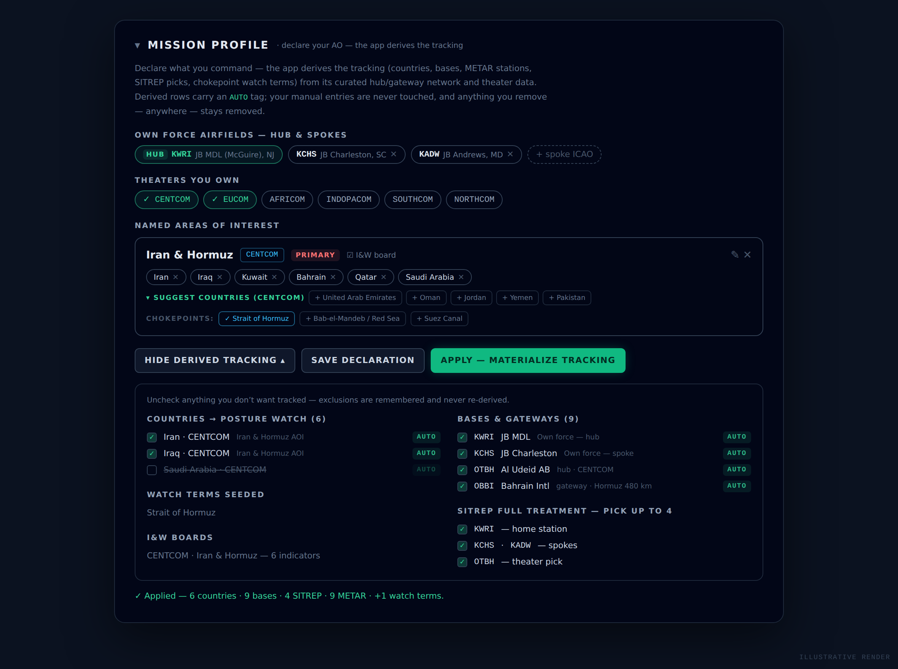
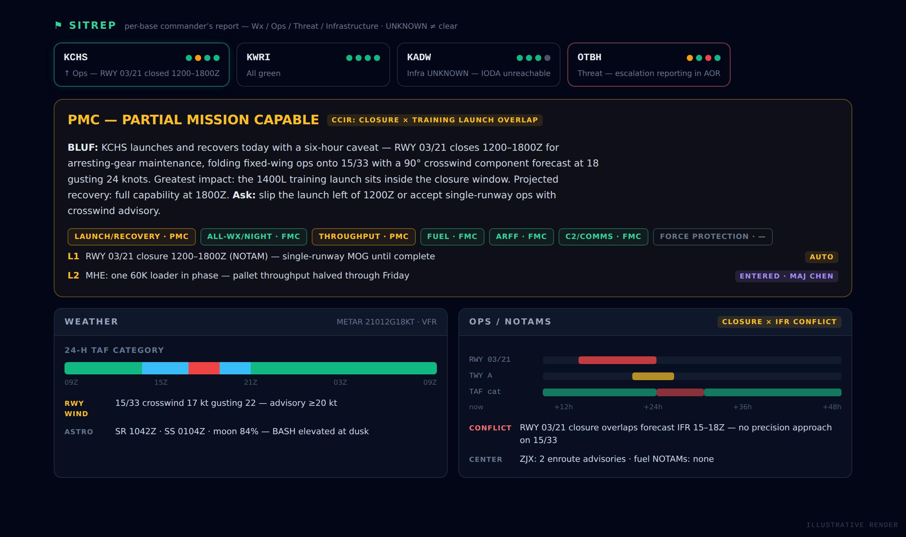
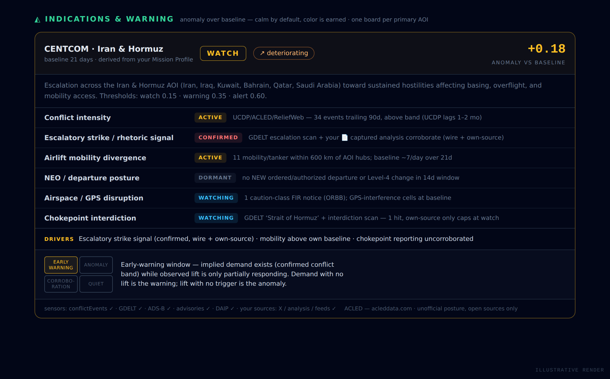

# DEAD's Dashboard

An **air-mobility / crisis-planning dashboard** for a mobility-forces commander:
national-security news, email, calendar, open-source intelligence, a live crisis
map, per-base SITREPs, and an indications-&-warning board fused into one
operational picture. Built with **Next.js 15 (App Router)** and deployed on
**GoDaddy Node.js Hosting** (managed Node.js PaaS + managed MySQL). Owner plus a
small crew allowlist.


> The dashboard is organized around one question: **where will mobility forces
> get tasked next — and what does it take to get there.** You declare *what you
> command*; the app derives *what to track and how to monitor it*.

---

## The Mission Profile — declare the AO, derive the tracking

Instead of hand-maintaining watchlists, the configuration starts from a
declaration (**Preferences → Mission Profile**): your **hub and spoke
airfields** (where crews and aircraft live), the **theaters you own**, and named
**Areas of Interest** like *Iran & Hormuz*. From that, the app derives the
tracking — and proposes what you might have missed:



- **Airfields** → Mobility Watch posture + METAR/TAF + SITREP candidacy
  (hub → spokes → theater hubs, in that priority). Tracked weather locations
  stay yours, for civil places — one channel per concept.
- **AOI countries** → the force-protection country watch (with one-tap
  *suggest countries* chips from the theater).
- **Chokepoints** (auto-suggested from AOI geography) → headline-matchable
  watch terms.
- **Primary AOIs** → a per-AOI **I&W warning board**, and the whole declaration
  rides into **every AI call** as one compact context line — the brief, chat,
  and all the reads reason from your declared AO without re-typing it.

The contract: everything derived is labeled `AUTO`, previewable before it
applies, and individually excludable; **manual entries are never touched, and
anything you delete — anywhere — stays deleted** across re-applies.

---

## Stack

| Layer | Choice |
|---|---|
| Frontend / SSR | Next.js 15 (App Router), React 19, Tailwind CSS |
| Server | custom `server.js` Next.js server (binds `process.env.PORT`) |
| Database | managed MySQL via `mysql2` (`lib/db.ts`) — schema auto-migrates |
| AI | Anthropic SDK (`@anthropic-ai/sdk`) — Opus / Sonnet / Haiku per route |
| Auth | NextAuth 5 + Google OAuth — owner (`OWNER_EMAIL`) + crew allowlist (`ALLOWED_EMAILS`) |
| Maps | React-Leaflet 5 + OpenStreetMap / CARTO dark tiles, `h3-js` for GPS hexes |
| Icons | `lucide-react` (vocabulary in `lib/icons.tsx`) |
| Realtime | `ws` — server-side AISStream vessel bridge |
| Alerting | Chrome extension (`tools/x-auto-capture/`) — capture + OS notifications |

All outbound traffic is **HTTPS (443)** only (plus the managed MySQL), per the
hosting platform's network policy. The container is ephemeral — all state lives
in the managed database.

---

## Features

Eight tabs, a timezone-aware Morning Brief (cached once per day *per zone*, so
devices share one generation and travel regenerates correctly; opens with a
deterministic "Your day" block — tasks + keep-in-touch — and a live Base SITREP
block), and a floating AI assistant whose conversation persists across
close/reopen.

- **Glance** — the landing view: Base SITREP LED strip, brief hero with
  generation stamp, **Needs you now** (your due/overdue tasks pinned in their
  own group with inline complete/defer, above world-state alerts), the ranked
  **Global Reach Watch** (NEO / disasters / weather / conflict / GPS /
  airspace), today/tomorrow schedule, and radar metrics with deltas.
- **News** — national-security RSS across ~20 sources, preference-sorted, with
  AI curation, article theses, cross-article threads, and feedback signals.
- **Calendar** — Google Calendar + Tasks (inline due-date editing), keep-in-touch
  contact cadences, iCal subscription, meeting prep.
- **Email** — AI-triaged unread inbox across primary + optional secondary Gmail,
  action-item extraction (auto-pruned as mail is cleared), VIP/mute rules,
  draft replies, one-click convert to task/event/doc.
- **Docs** — a markdown wiki grown into a synthesis workbench: typed wiki-links,
  aliases, backlinks with snippets, unlinked-mention detection, collections /
  doc types / properties, a local knowledge graph, lexicon, thread timelines,
  compose-to-deliverable, split-at-headings, templates, version history, and a
  file repo. Quick capture (⌘K) routes thoughts here (`doc` kind + a findable
  "Capture Inbox"), with high-confidence tasks auto-committed behind an Undo.
- **OSINT** — feed panes (All / Social / Telegram / News / Crisis / Ground /
  SITREP / I&W / Sources) over the **Crisis map**: disasters, conflict
  (UCDP/ACLED), weather hazards, GPS interference, FIR/overflight NOTAMs, live
  military ADS-B + AIS, AMC hubs/gateways with runway capability + live flight
  categories, and planning-grade reach rings. The map remembers your view and
  AOR filter, and a **⌂ My AO** preset opens on your declared theater.
  **Ground Truth** is a per-country situation room (incidents, advisories,
  health, holidays, your captured sources, AI SITREP). The **Sources pane** is
  the ingestion control room — browser-captured X posts / analysis articles /
  LiveUAMap events (captured in *your* logged-in browser, never server-side),
  plus the live RSS/Telegram feed editor with AO-aware suggestions.
- **Weather** — multi-location NWS + Open-Meteo forecast cards for your civil
  places, severe-weather threat board, NOAA space weather, and METAR/TAF for
  every airfield the profile tracks.
- **Economy** — mobility economics: energy/fuel prices, an AI *Economic Access
  Read*, and a strategic-chokepoint watch.

### SITREP — the per-base commander's report



Up to 4 fields get the full treatment: decoded METAR + 24-h TAF category
timeline, bucketed DAIP NOTAMs with a **closure-window timeline**
(runway-closure × forecast-IFR conflicts called out), per-runway crosswind
advisories, ARTCC center NOTAMs, astro/illumination + BASH, force protection,
disasters, impact-filtered local news, and live infrastructure sensing (IODA
internet, FAA NAS, USGS gauges). A **mission-capability / LIMFAC layer**
synthesizes it for leadership (FMC/PMC/NMC across 7 airfield functions, CCIRs,
a crew-shared LIMFAC register) with an AI **Commander's Read** (BLUF → impact →
recovery → asks) and **⇩ Export HTML** — a self-contained, script-free snapshot
shareable with people who have no dashboard access. Every unreachable source
renders **UNKNOWN, never implied-clear**.

### Indications & Warning — one board per AOI



A doctrine-grounded warning board (Grabo: anomaly & trajectory, not level) —
**calm by default; color is earned** by the anomaly crossing pre-registered
thresholds. Each primary AOI instantiates the six-indicator template against its
own geography: conflict intensity vs trailing baseline, escalatory
strike/rhetoric (wire + your own captured sources corroborate; own-source-only
caps at watch), the **airlift mobility divergence** sensor (observed lift vs
implied demand — the off-diagonal is the product), NEO/departure posture,
airspace/GPS disruption, and chokepoint interdiction. Every indicator carries a
falsifier and open-source provenance; fresh boards hold in learning mode until a
real baseline forms.

### The app comes to you

The capture extension doubles as the alerting transport: on a configurable
cadence it polls `/api/alerts/check` and raises **OS notifications** — with the
dashboard closed — for force-protection RED transitions, life-threatening
weather at your locations, ordered-departure advisories, and I&W boards
reaching warning/alert.

See **[FEATURES.md](FEATURES.md)** for the per-feature inventory and
**[CLAUDE.md](CLAUDE.md)** for platform/deployment notes and the rationale
behind non-obvious design decisions.

> Screenshots are illustrative renders of the UI (sources in `docs/mockups/`,
> regenerate with `docs/mockups/render.sh`) — the live app requires Google
> sign-in and live data feeds.

---

## Getting started (local)

Requires Node.js 20+.

```bash
npm install
cp .env.example .env.local   # fill in the values below
npm run build                 # next build (via build.js)
npm start                     # custom server on $PORT (default 3000)
```

For iterative development:

```bash
npm run dev                   # next dev with hot reload
```

### Tests

```bash
npm test                      # npx vitest run — needs network (vitest is fetched on demand)
```

Pure logic (parsers, scorers, matchers, the Mission Profile derivation) is
unit-tested against committed fixtures, since the build sandbox can't reach
external data hosts. Live data sources are verified in production via owner-only
`?debug=1` / `*-diag` endpoints.

---

## Environment variables

`PORT` and the `DB_*` connection variables are provided automatically by the
hosting platform. The rest are set via the hosting UI (see `.env.example`):

**Required:** `NEXTAUTH_URL`, `NEXTAUTH_SECRET`, `GOOGLE_CLIENT_ID`,
`GOOGLE_CLIENT_SECRET`, `ANTHROPIC_API_KEY`, `OWNER_EMAIL`.

**Optional** (feature simply stays off when unset, never a hard error):
`ALLOWED_EMAILS` (comma-separated additional sign-ins — crew accounts get their
own email/calendar/brief/chat memory; team config stays owner-managed),
`GMAIL_SECONDARY_REDIRECT_URI` (second Gmail account), `AISSTREAM_API_KEY` (live
maritime AIS), `UCDP_API_TOKEN` (Crisis-map conflict layer), and ACLED
credentials (set in Preferences, or `ACLED_EMAIL` / `ACLED_PASSWORD` to
override).

---

## Database

The managed MySQL instance is provisioned by the platform; credentials arrive as
`DB_HOST` / `DB_PORT` / `DB_NAME` / `DB_USER` / `DB_PASSWORD`. Schema is created
automatically on first connection — every table is `CREATE TABLE IF NOT EXISTS`
with idempotent additive-column and primary-key migrations in `lib/db.ts`, so
**no manual import is needed**. All queries are parameterized.

---

## Deployment

Built for GoDaddy Node.js Hosting: upload the project folder; the platform runs
`npm install` → `npm run build` → `npm start`. A few platform-specific
constraints are load-bearing and documented in **[CLAUDE.md](CLAUDE.md)**:

- The build toolchain (`typescript`, `tailwindcss`, `postcss`, …) lives in
  **`dependencies`**, not `devDependencies` — the platform installs with
  `--production`.
- **No `esbuild` in the dependency tree** (`grep -c esbuild package-lock.json`
  must stay `0`) — it breaks the platform's archive extract / sandboxed install.
  Tests run via `npx vitest` on demand so esbuild never enters the installed tree.

### Browser extension

`tools/x-auto-capture/` is a Chrome/Edge MV3 extension (load unpacked) that runs
in **your own logged-in browser**: scheduled capture of X lists and LiveUAMap
region maps, one-click capture of analysis articles you're reading, and the
alert-notification poll. Uploads authenticate with a per-user bearer token
(SHA-256-hashed server-side, generated in OSINT → Sources).

---

## Project structure

```
app/           Next.js App Router routes + API endpoints
components/    React UI, grouped by tab (glance/, news/, osint/, ground/, …)
lib/           Data sources, parsers, scorers, DB, auth, AI helpers
tests/         Vitest unit tests + fixtures
tools/         The capture/alerting browser extension (outside the build)
docs/          README screenshots + their mockup sources (docs/mockups/)
server.js      Custom Next.js production server (binds $PORT)
build.js       Production build wrapper
```

`lib/` modules that are imported by client components stay **pure** (no
`node:*`, no heavy deps) so they don't drag server-only trees into the browser
bundle — `lib/missionProfile.ts` (the derivation) is the flagship example:
client-previewable, unit-tested, side-effect-free.
