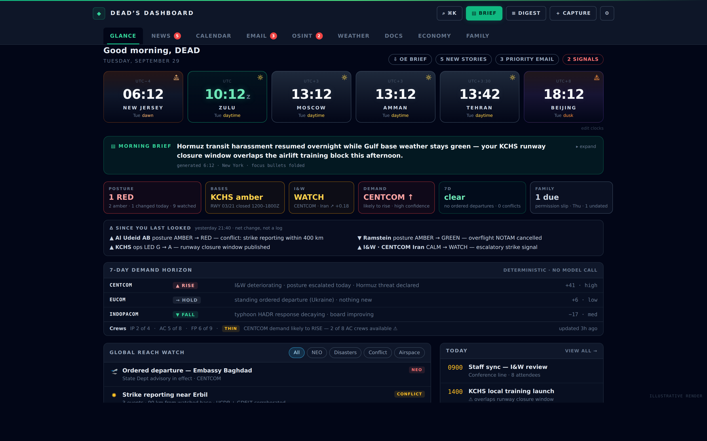
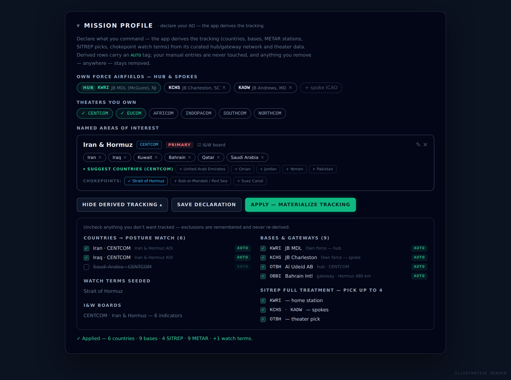
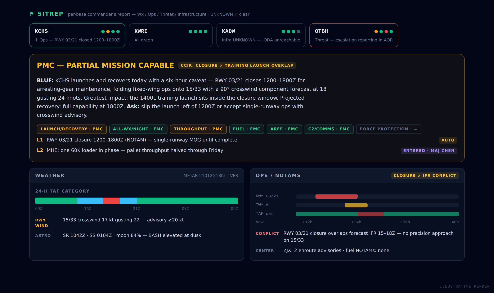
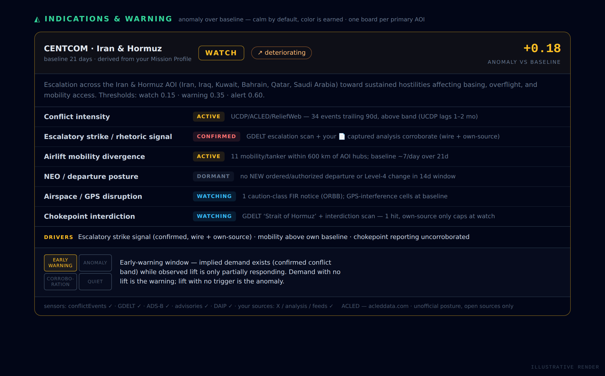

# DEAD's Dashboard

An **air-mobility / crisis-planning dashboard** for a mobility-forces commander:
national-security news, email, calendar, open-source intelligence, a live crisis
map, per-base SITREPs, and an indications-&-warning board fused into one
operational picture. Built with **Next.js 15 (App Router)** and deployed on
**GoDaddy Node.js Hosting** (managed Node.js PaaS + managed MySQL). Owner plus a
small crew allowlist.



> The dashboard is organized around one question: **where will mobility forces
> get tasked next — and what does it take to get there.** You declare *what you
> command*; the app derives *what to track and how to monitor it*.

---

## The Mission Profile — declare the AO, derive the tracking

Instead of hand-maintaining watchlists, the configuration starts from a
declaration (**Preferences → Mission Profile**): your **hub and spoke
airfields** (where crews and aircraft live), the **theaters you own**, and named
**Areas of Interest** like *Iran & Hormuz*. From that, the app derives the
tracking — and proposes what you might have missed:



- **Airfields** → Force posture posture + METAR/TAF + SITREP candidacy
  (hub → spokes → theater hubs, in that priority). Tracked weather locations
  stay yours, for civil places — one channel per concept.
- **AOI countries** → the force-protection country watch (with one-tap
  *suggest countries* chips from the theater).
- **Chokepoints** (auto-suggested from AOI geography) → headline-matchable
  watch terms.
- **Primary AOIs** → a per-AOI **I&W warning board**, and the whole declaration
  rides into **every AI call** as one compact context line — the brief, chat,
  and all the reads reason from your declared AO without re-typing it.

The contract: everything derived is labeled `AUTO`, previewable before it
applies, and individually excludable; **manual entries are never touched, and
anything you delete — anywhere — stays deleted** across re-applies.

---

## Stack

| Layer | Choice |
|---|---|
| Frontend / SSR | Next.js 15 (App Router), React 19, Tailwind CSS |
| Server | custom `server.js` Next.js server (binds `process.env.PORT`) |
| Database | managed MySQL via `mysql2` (`lib/db.ts`) — schema auto-migrates |
| AI | Anthropic SDK (`@anthropic-ai/sdk`) — Opus / Sonnet / Haiku per route |
| Auth | NextAuth 5 + Google OAuth — owner (`OWNER_EMAIL`) + crew allowlist (`ALLOWED_EMAILS`) |
| Maps | React-Leaflet 5 over keyless Esri / OpenStreetMap basemap chains (`lib/basemaps.ts`, self-healing on a refusing provider), `h3-js` for GPS hexes |
| Icons | `lucide-react` (vocabulary in `lib/icons.tsx`) |
| Realtime | `ws` — server-side AISStream vessel bridge |
| Alerting | Web push (installable PWA, `web-push`) + the Chrome extension (`tools/x-auto-capture/`) — capture, OS notifications, the alert poll |

All outbound traffic is **HTTPS (443)** only (plus the managed MySQL), per the
hosting platform's network policy. The container is ephemeral — all state lives
in the managed database.

---

## Features

Nine tabs, a timezone-aware Morning Brief (cached once per day *per zone*;
"today" follows the pinned zone › an active TDY › the device), a ⌘K command
palette that reaches every surface by name, and a floating assistant that
carries the dashboard's own computed picture (posture, SITREP LEDs, I&W
boards, alerts, what changed since you looked) into every turn.

- **Glance** — the landing view: world clocks west→east with the part of the
  day, **weather where you are** (home or the active TDY, with the nearest
  tracked airfield's flight category), the Morning Brief overview, the
  **RIGHT NOW** status row (Posture · Bases · I&W · Spectrum · Demand ·
  Alerts · Tasks · Family — colour is earned, UNKNOWN is its own tone), the
  **OE delta** ("what changed since you last looked", net change per
  subject, improvements first-class), **Needs you now**, the **7-day demand
  horizon** per combatant command with crew posture against it, the ranked
  **Global Reach Watch**, posture moves read from the news, and the day.
- **News** — **Threads** first (the day's narratives with trajectory, sources
  added / dropped, the AMC angle, doors to the I&W board or chokepoint they
  touch; capped at three model reads a day), then the **Read** view in lanes
  (depth · now · rest) with newsletters as an earned queue.
- **Calendar** — **Don't miss** (family deadlines, tasks and check-ins in one
  list, late → today → week), the agenda in the effective zone with TDY day
  chips (＋ TDY and end / remove on the chip; tap the zone label to pin it), **Dates in your mail** (＋ Event / ＋ Task from a date the triage
  found — never a guessed date), keep-in-touch cadences, tasks, iCal.
- **Email** — the sift: always grouped High → Medium → Low with per-group
  mark-read, **Keep** (held at both ends — the UI and the mark-read route),
  a per-email priority menu with "Always High / Low from this sender", a
  **why** line on every row, learning from your corrections (suggested
  sender rules, corrections fed back to the classifier), action items cached
  per message, keyboard triage, **File under Family**, a second Gmail account.
- **Family** — the unit is the deadline, not the email: school deadlines
  merged across newsletters with Done / Not mine / Set date / snooze, a
  **running brief per person** (updated, never rewritten; "what's new"
  highlighted), **while you are away** against the active trip, events per
  person, proposals mined from mail already read; the **Household** pane
  watches bills (cadence learned, silence watch, amount creep), declared
  documents with lead days, and account jeopardy. The roster is the query:
  only declared senders are ever read.
- **Docs** — a markdown wiki grown into a synthesis workbench: typed
  wiki-links, aliases, backlinks with snippets, unlinked mentions,
  collections / doc types / properties, a local graph, lexicon, thread
  timelines, compose-to-deliverable, split-at-headings, templates, version
  history, **running logs** (📓 — append a dated entry from anywhere: select
  text and tap ⧉, a Thesis, the assistant, ⌘K, or "add to my China log: …"
  in Capture), and a file repo with bulk upload, zip download and an inline
  PDF preview.
- **OSINT** — three panes: **◆ Commands · ≣ Feeds · ⇪ Sources**.
  **Commands** is one page in drill order: **Where to look first** (a
  ranked, deterministic primer — every line a door; an AI read on tap),
  **My airfields** (hub, spokes and ★ fields with five LEDs and a hub /
  spoke switch), **one row per combatant command** (I&W · posture · bases ·
  7-day demand · events · Δ since your look, with a why) that drills in place
  to its boards and countries, and **Airfields by command** (every tracked
  field, worst first, hide-green). A country, an airfield or a board opens
  as a page in **the room** — one drawer with tabs (incidents, news, civil,
  health, spectrum, airfields; SITREP weather / ops / threats / infra /
  spectrum / history), ‹ › through the command, ⇥ pin as a right column,
  Esc / ← / →, and a `?room=` deep link. Add, remove and re-role airfields
  and countries from the board itself. Below it the **Crisis map** follows
  whatever is open: disasters, conflict (UCDP / ACLED), weather hazards, GPS
  interference, FIR / overflight NOTAMs, live military ADS-B + AIS, hubs /
  gateways with runway capability and flight categories, planning-grade
  reach rings, outages and launches, and the **Significant events** list
  with "near my airfields" and "new since look" lenses. **Feeds** merges the
  reporting list (clustering, triage, the Situation line). **Sources** is
  the ingestion control room — browser-captured X posts / analysis articles
  / LiveUAMap events / MOFCOM notices (captured in *your* logged-in browser,
  never server-side), the live RSS / Telegram feed editor with AO-aware
  suggestions, and watchlist recommendations with their evidence.
- **Weather** — where you are first, then your civil places (NWS + Open-Meteo,
  7-day worldwide), your **airfields by combatant command** (decoded METAR,
  24-h TAF category bar, model hazards, crosswind, a SITREP door), threats &
  disasters by command, a map that follows the selection, and space weather
  in one crew sentence. Places and airfields are added or removed on the
  page through the one Track command (⌂ set home the same way); a sources
  strip names every feed.
- **Economy** — **Economic Warfare Watch**: one tile per tracked actor
  (I&W level against its own baseline, lit instrument chips, the driver in
  words, an editor for the register), a moves-and-counter-moves timeline
  with one lane per actor, the coercion board (one author per headline;
  reversals graded as such), the leverage map, chokepoints with AIS transit
  counts, energy, U.S. regulatory actions, EU / UK listing waves, and an AI
  read that never blanks.

### SITREP — the per-base commander's report



Up to 6 fields get the full treatment (hub first, then ★ must-tracks): decoded METAR + 24-h TAF category
timeline, bucketed DAIP NOTAMs with a **closure-window timeline**
(runway-closure × forecast-IFR conflicts called out), per-runway crosswind
advisories, ARTCC center NOTAMs, astro/illumination + BASH, force protection,
disasters, impact-filtered local news, and live infrastructure sensing (IODA
internet, FAA NAS, USGS gauges). A **mission-capability / LIMFAC layer**
synthesizes it for leadership (FMC/PMC/NMC across 7 airfield functions, CCIRs,
a crew-shared LIMFAC register) with an AI **Commander's Read** (BLUF → impact →
recovery → asks) and **⇩ Export HTML** — a self-contained, script-free snapshot
shareable with people who have no dashboard access. Every unreachable source
renders **UNKNOWN, never implied-clear**.

### Indications & Warning — one board per AOI



A doctrine-grounded warning board (Grabo: anomaly & trajectory, not level) —
**calm by default; color is earned** by the anomaly crossing pre-registered
thresholds. Each primary AOI instantiates the six-indicator template against its
own geography: conflict intensity vs trailing baseline, escalatory
strike/rhetoric (wire + your own captured sources corroborate; own-source-only
caps at watch), the **airlift mobility divergence** sensor (observed lift vs
implied demand — the off-diagonal is the product), NEO/departure posture,
airspace/GPS disruption, and chokepoint interdiction. Every indicator carries a
falsifier and open-source provenance; fresh boards hold in learning mode until a
real baseline forms.

### The app comes to you

The capture extension doubles as the alerting transport: on a configurable
cadence it polls `/api/alerts/check` and raises **OS notifications** — with the
dashboard closed — for force-protection RED transitions, life-threatening
weather at your locations, ordered-departure advisories, and I&W boards
reaching warning/alert.

See **[FEATURES.md](FEATURES.md)** for the per-feature inventory and
**[CLAUDE.md](CLAUDE.md)** for platform/deployment notes and the rationale
behind non-obvious design decisions.

> Screenshots are illustrative renders of the UI (sources in `docs/mockups/`,
> regenerate with `docs/mockups/render.sh`) — the live app requires Google
> sign-in and live data feeds.

---

## Getting started (local)

Requires Node.js 20+.

```bash
npm install
cp .env.example .env.local   # fill in the values below
npm run build                 # next build (via build.js)
npm start                     # custom server on $PORT (default 3000)
```

For iterative development:

```bash
npm run dev                   # next dev with hot reload
```

### Tests

```bash
npm test                      # npx vitest run — needs network (vitest is fetched on demand)
```

Pure logic (parsers, scorers, matchers, the Mission Profile derivation, the
severity and AOR vocabularies, the SSRF guard) is unit-tested — 117 files —
against committed fixtures, since the build sandbox can't reach external data
hosts. Live data sources are verified in production via owner-only
`?debug=1` / `*-diag` endpoints.

---

## Environment variables

`PORT` and the `DB_*` connection variables are provided automatically by the
hosting platform. The rest are set via the hosting UI (see `.env.example`):

**Required:** `NEXTAUTH_URL`, `NEXTAUTH_SECRET`, `GOOGLE_CLIENT_ID`,
`GOOGLE_CLIENT_SECRET`, `ANTHROPIC_API_KEY`, `OWNER_EMAIL`.

**Optional** (feature simply stays off when unset, never a hard error):
`ALLOWED_EMAILS` (comma-separated additional sign-ins — crew accounts get their
own email/calendar/brief/chat memory; team config stays owner-managed),
`GMAIL_SECONDARY_REDIRECT_URI` (second Gmail account), `AISSTREAM_API_KEY` (live
maritime AIS), `UCDP_API_TOKEN` (Crisis-map conflict layer), ACLED
credentials (set in Preferences, or `ACLED_EMAIL` / `ACLED_PASSWORD` to
override), and `VAPID_PUBLIC_KEY` / `VAPID_PRIVATE_KEY` / `VAPID_SUBJECT`
(web push — `npx web-push generate-vapid-keys`).

---

## Database

The managed MySQL instance is provisioned by the platform; credentials arrive as
`DB_HOST` / `DB_PORT` / `DB_NAME` / `DB_USER` / `DB_PASSWORD`. Schema is created
automatically on first connection — every table is `CREATE TABLE IF NOT EXISTS`
with idempotent additive-column and primary-key migrations in `lib/db.ts`, so
**no manual import is needed**. All queries are parameterized.

---

## Deployment

Built for GoDaddy Node.js Hosting: upload the project folder; the platform runs
`npm install` → `npm run build` → `npm start`. A few platform-specific
constraints are load-bearing and documented in **[CLAUDE.md](CLAUDE.md)**:

- The build toolchain (`typescript`, `tailwindcss`, `postcss`, …) lives in
  **`dependencies`**, not `devDependencies` — the platform installs with
  `--production`.
- **No `esbuild` in the dependency tree** (`grep -c esbuild package-lock.json`
  must stay `0`) — it breaks the platform's archive extract / sandboxed install.
  Tests run via `npx vitest` on demand so esbuild never enters the installed tree.

### Security model

Google sign-in gated by an allowlist that is re-checked on every token
refresh (removing a crew address takes effect within minutes, not at JWT
expiry); team configuration (tracking, Mission Profile, SITREP slots, feeds,
ACLED credentials, capture corpora) is owner-only, personal surfaces are
keyed per user; user-supplied feed URLs are resolved and redirect-checked
before any server-side fetch (`lib/safeFetch.ts`); uploaded files are served
inline only for types a browser renders without executing anything;
parameterized SQL throughout; a CSP without `unsafe-eval` in production.
Diagnostic routes (`*-diag`, `?debug=1`) are owner-only.

### Browser extension

`tools/x-auto-capture/` is a Chrome/Edge MV3 extension (load unpacked) that runs
in **your own logged-in browser**: scheduled capture of X lists and LiveUAMap
region maps, one-click capture of analysis articles you're reading, and the
alert-notification poll. Uploads authenticate with a per-user bearer token
(SHA-256-hashed server-side, generated in OSINT → Sources).

---

## Project structure

```
app/           Next.js App Router routes + API endpoints
components/    React UI, grouped by tab (glance/, news/, osint/, ground/, …)
lib/           Data sources, parsers, scorers, DB, auth, AI helpers
tests/         Vitest unit tests + fixtures
tools/         The capture/alerting browser extension (outside the build)
docs/          README screenshots + their mockup sources (docs/mockups/)
server.js      Custom Next.js production server (binds $PORT)
build.js       Production build wrapper
```

`lib/` modules that are imported by client components stay **pure** (no
`node:*`, no heavy deps) so they don't drag server-only trees into the browser
bundle — `lib/missionProfile.ts` (the derivation) is the flagship example:
client-previewable, unit-tested, side-effect-free.
